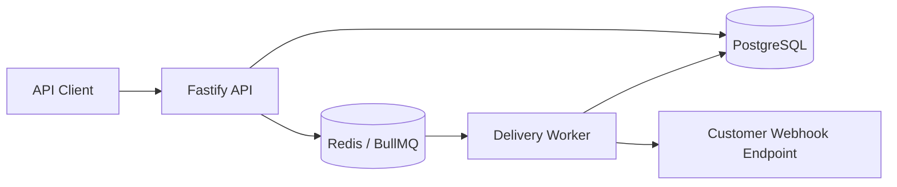

# HookForge

HookForge is a production-style webhook delivery platform built with Node.js, TypeScript, PostgreSQL, Redis, and BullMQ.

It demonstrates backend patterns that show up in real SaaS infrastructure: API key authentication, asynchronous delivery, HMAC signatures, retry policies, delivery logs, replay, dead-letter handling, health checks, OpenAPI docs, and local infrastructure with Docker Compose.

## Architecture



## Tech Stack

- Node.js 20 and TypeScript
- Fastify API
- PostgreSQL with Prisma
- Redis and BullMQ for background delivery
- Zod validation
- HMAC SHA-256 webhook signatures
- Docker Compose for local infrastructure
- GitHub Actions CI

## Getting Started

```bash
cp .env.example .env
npm install
docker compose up -d
npm run db:generate
npm run db:migrate
npm run build
```

Run the API and worker in separate terminals:

```bash
npm run dev:api
npm run dev:worker
```

The API runs on `http://localhost:3000`.

OpenAPI docs are available at `http://localhost:3000/docs`.

## Demo Flow

Create a project and copy the returned API key:

```bash
curl -X POST http://localhost:3000/projects \
  -H "content-type: application/json" \
  -d '{"name":"Acme SaaS"}'
```

Register a webhook endpoint:

```bash
curl -X POST http://localhost:3000/endpoints \
  -H "authorization: Bearer hf_replace_me" \
  -H "content-type: application/json" \
  -d '{"url":"https://webhook.site/your-url","description":"Webhook.site test endpoint"}'
```

Publish an event:

```bash
curl -X POST http://localhost:3000/events \
  -H "authorization: Bearer hf_replace_me" \
  -H "content-type: application/json" \
  -d '{"type":"invoice.paid","payload":{"invoiceId":"inv_123","amount":4900}}'
```

Inspect recent deliveries:

```bash
curl http://localhost:3000/deliveries \
  -H "authorization: Bearer hf_replace_me"
```

Replay a delivery:

```bash
curl -X POST http://localhost:3000/deliveries/delivery_id/replay \
  -H "authorization: Bearer hf_replace_me"
```

## Signature Verification

Every webhook request includes:

- `x-hookforge-signature`: HMAC SHA-256 signature
- `x-hookforge-timestamp`: Unix timestamp used in the signed payload
- `x-hookforge-event-id`: Event identifier

The signature is generated from:

```text
timestamp.rawBody
```

using the endpoint secret as the HMAC key.

## Repository Layout

```text
apps/
  api/       Fastify HTTP API
  worker/    BullMQ webhook delivery worker
packages/
  db/        Prisma schema and database client
  shared/    Validation, signing, and retry helpers
```

## Roadmap

- Dashboard UI for event and delivery inspection
- Endpoint secret rotation
- Organization users and RBAC
- Webhook event filtering by endpoint
- OpenTelemetry traces and metrics
- Load test scenario with k6
